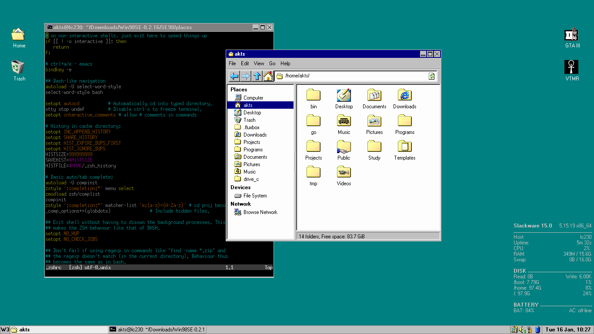

# Chicago95 fluxbox

A fluxbox style to complement the [Chicago95 gtk theme](https://github.com/grassmunk/Chicago95).

## Screenshots

1. Clean


2. Messy



## Installation

Copy the `Chicago95` folder to your `~/.fluxbox/styles` folder.

## What's in the screenshots?

Take a peek in the [extras](./extras) folder :)

1. Conky on the bottom right.
2. Idesk for the desktop icons.
3. `feh` for managing wallpapers.
4. GTK theme is `Chicago95` and the icon theme is [SE98](https://github.com/nestoris/Win98SE).
5. The fluxbox menu is generated by a wonderful program called[xdgmenumaker](https://github.com/gapan/xdgmenumaker). Behold, the command

```
# without icons
#xdgmenumaker -f fluxbox --no-submenu > ~/.fluxbox/xdg_menu

# with icons
xdgmenumaker -f fluxbox --no-submenu -i > ~/.fluxbox/xdg_menu_icons
```

Then to include the menu in the main `RootMenu`, add the following to `~/.fluxbox/menu`

```
    [separator]
    [include] (~/.fluxbox/xdg_menu_icons)
    [separator]

```


